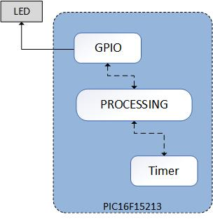

<!-- Please do not change this html logo with link -->

# Blink LED using PIC16F15213 Microcontroller

## Introduction

Timer is a most common and very useful peripheral of the microcontrollers in various embedded applications. The timer can be used to generate events at specific times, measure duration (i.e., time interval) between specific events, generate delays, generate waveform, count external events and to measure input signal frequency and duty cycle.

The most common and basic use of the timer peripheral is generation of events at specific times, using the timer interrupt feature.

The repository provides “Blink LED using PIC16F15213 Microcontroller” code example, generated on PIC16F15213 microcontroller and using MPLAB X IDE and MPLAB Code Configurator. 

The code example demonstrates how to use an 8-bit timer in interrupt mode to generate periodic timeouts and how to configure a GPIO of the microcontroller to toggle LED at required interrupt event.

This code example is associated with “Migration from PIC12F to PIC16F15244 Microcontroller Family” guide and acts as a reference showcasing the code example, which is migrated from the PIC12F1572 MCU code example, this document also showcasing the required steps to be followed to migrate application firmware from PIC12F1572 MCU to PIC16F15244 family microcontrollers.

**Note:** ***This example could be generated with all the pin variants of PIC16F15244 family microcontrollers.***

## Related Documentation

More details on PIC16F15244 family microcontrollers and code examples can be found at the following links:

- [Blink LED with Timer and Interrupt Using PIC16F15213](https://github.com/microchip-pic-avr-examples/pic16f15213-curiosity-lpc-blink-led-timer-mplab-mcc)
- [Migration from PIC12F to PIC16F15244 Microcontroller Family](https://www.microchip.com/DS40002319) 
- [PIC16F152xx Family Product Brief](https://ww1.microchip.com/downloads/en/DeviceDoc/40002140A.pdf)
- [PIC16F15213 Product Page](https://www.microchip.com/wwwproducts/en/PIC16F15213)
- [PIC16F15213 Datasheet](https://www.microchip.com/wwwproducts/en/PIC16F15213)
- [PIC16F152xx Family Code Examples on GitHub](https://github.com/microchip-pic-avr-examples?q=PIC16F152&type=&language=&sort=)

## Demo Description

In this code example, PIC16F15213 microcontroller timer peripheral is configured to periodically generate overflow interrupt with period of 30 milliseconds. Upon each interrupt event, the application counts the number of interrupts and toggles the state of connected LED through GPIO Pin for every one second.

  
   Figure 1 : LED Blink Hardware Overview 

## Software Used

- MPLAB® X IDE [6.0.0 or newer](https://www.microchip.com/en-us/development-tools-tools-and-software/mplab-x-ide)
- MPLAB® XC8 Compiler [2.36.0 or newer](https://www.microchip.com/en-us/development-tools-tools-and-software/mplab-xc-compilers)
- Microchip PIC16F1xxxx_DFP Series Device Support [1.9.163 or newer](https://packs.download.microchip.com/) 
- MPLAB® Code Configurator (MCC) [5.1.1 or newer](https://www.microchip.com/mplab/mplab-code-configurator)
- TMR0 MCC Melody driver 4.0.7
- GPIO/Pins drivers MCC Melody driver 3.2.2
  
**Note: For running this demo, the installed tool version should be same or later. This example is not tested with the previous versions.**

## Hardware Used

- [Curiosity Low Pin Count (LPC) Development Board](https://www.microchip.com/DevelopmentTools/ProductDetails/PartNO/DM164137)

## Hardware setup 

The Curiosity LPC Development Board with PIC16F15213 microcontroller is used as hardware platform, the demonstration hardware setup is showed in the following image.

  
   Figure 2 : Led Blink Example Hardware Setup 

## Hardware connection table

Following table shows the pin connection details of the hardware setup

|Sl No. | Microcontroller pin | Click board/peripheral | Signal name |I/O Pin Direction |
|:---------:|:----------:|:-----------:|:---------:|:------------:|	
| 1     | RA4	| I/O Port	        | GPIO Pin	| OUT  |	
		

## Demo Operation

* Setup the hardware as shown in the “Hardware Setup” section.
* Power on the Curiosity LPC board by connecting the micro-USB cable from micro-USB socket on the Curiosity LPC board to the PC USB socket.
* Download the example project to your local folder / Browse the migrated project.
* Open project using MPLAB X IDE.
* Click on "Make and Program Device" to program the MCU.
* The LED connected to pin RA4 start toggling with a periodicity of one second.

**Note** : ***Refer [MPLAB X user guide](https://ww1.microchip.com/downloads/en/devicedoc/50002027d.pdf) for more details on MPLAB X IDE.***

## Peripheral configurations using MCC

The following configurations must be made for this code example:

### Clock Configuration:
Open "Clock Control" setup present under "System" dropdown menu in "Project Resources" tab.
* Set "Clock Source" as "HFINTOSC"
* Set "HF Internal Clock" as "8_MHz"
* Set "Clock Divider" as "1"

Figure 3 shows the MCC System module window: 

  
   Figure 3 : MCC System Module window 

### Timer 0 Configuration:
Add TMR0 peripheral to the project from Device Resources → Drivers.
* Set “Clock Prescaler” as “1:256”
* Set “Timer Mode” as “8-bit”
* Set “Clock Source” as “FOSC/4”
* Set “TMR Interrupt” as “Yes”

Figure 4 shows the MCC Timer 1 module window:

  
   Figure 4 : MCC TMR0 Module window 

### Pin Module:
Open Pin Module and edit the Custom Name field.
* Add custom name to the RA4 output pin as LED

Figure 5 shows the MCC Pin module window:

  
   Figure 5 : MCC Pin Module window 

